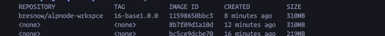

# AlpNode Workspace - Tiny Alpine Pro Environments


Inspired by [Bluxmit's Alnoda Workspaces](https://github.com/bluxmit/alnoda-workspaces). I wanted to build the tiniest possible nodejs cloud workspace. Trimmed the fat by reducing redundant and/or unneeded  programs, apps, users and runtimes. However, still with an intuitive and *comfortable* workflow. 

Alnoda Ubuntu/base workspaces average ~1-3GB after the container build step *(...still a really **awesome** project)*. Alpnode base workspace is ~300MB after build.
More machine resources available for your project. 



## Base Workspace includes:
- Zsh, Oh my Zsh
- Node
- curl, wget
- Git: git, git-flow, lazygit
File browsers: mc, [Filebrowser](https://github.com/filebrowser/filebrowser)
- vim
- htop
- supervisord
- cron
- dmidecode (Must run with ```--privileged```)


All CLI programs accessable via [Web Terminal](https://github.com/tsl0922/ttyd)


## Runtime

```
docker run --rm --privileged -p 8046:8026 -p 8041:8021 --privileged bresnow/alpnode-wrkspce:16-base -n space
```

## Additional Packages

If you wanted to install additional packages and build your own image based upon this one you'd start your Dockerfile like this:

```
FROM bresnow/alpnode-wrkspce:16-base

RUN apk -add U -v package_name package_name

...
```
## More/ TODOs

I will be adding more and updating the repo regularly. 

- [ ] Traefik reverse proxy with compose/swarm config.
- [ ] IDE workspaces / Codespaces alternative
- [ ] Customization config setup to deploy white-label apps