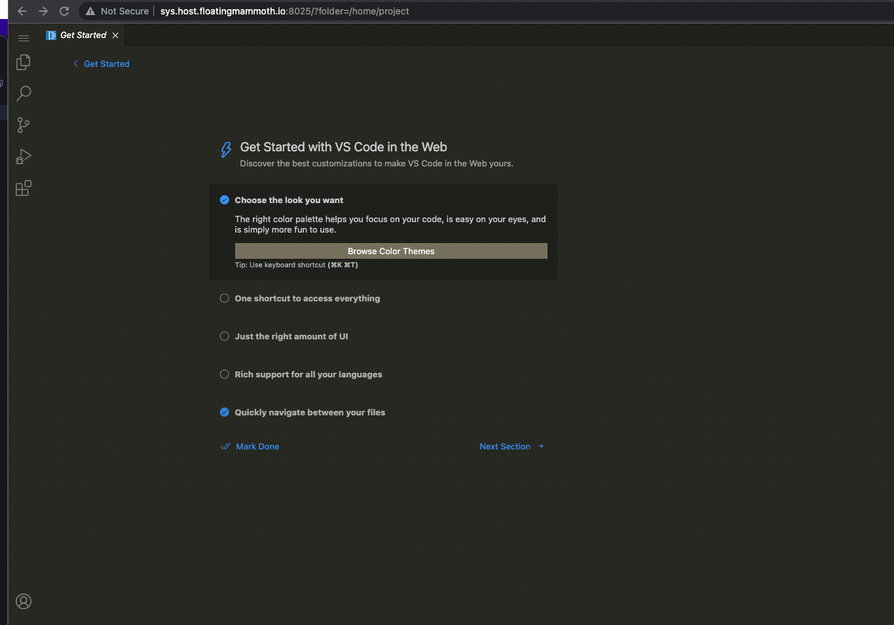

# CodeServer Workspace - IDE



Everything in the `bresnow/alpnode-wrkspce:base` except with a web facing IDE.

## Runtime

```
docker run --rm -p 8046:8026 -p 8041:8021 -p 8045:8025 bresnow/alpnode_code_workspace:latest -n ide
```

Then go to http://localhost:8045

## Additional Packages

If you wanted to install additional packages and build your own image based upon this one you'd start your Dockerfile like this:

```
FROM bresnow/alpnode_code_workspace:latest

RUN apk -add U -v package_name package_name

...
```
